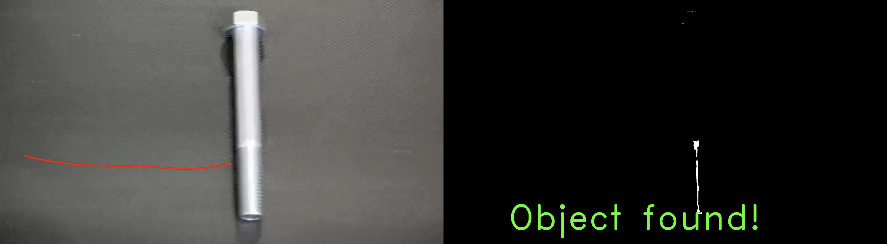

# Object Tracking and Detection in Video

## Overview
This Python script processes video input to detect and track objects within each frame using the OpenCV library. It employs color thresholding and movement tracking to identify objects, with an added feature to annotate video frames with visual indicators of the object's status. To enhance tracking performance, the script uses a moving average for smoother output.

---

## Features
- **Object Detection:** Identifies objects in video frames based on color thresholds.
- **Movement Tracking:** Tracks the detected object's movement across video frames.
- **Real-Time Annotations:** Displays visual indicators to highlight the object's presence and status.
- **Smooth Tracking:** Implements a moving average algorithm to reduce noise and improve tracking stability.

---

## Prerequisites
- Python 3.8+
- OpenCV library (`cv2`)

Install dependencies using:
```bash
pip install opencv-python
```

## Example Output
### Screenshot of newVideo.mov without object in frame

### Screenshot of newVideo.mov with object in frame



## License
- This project is licensed under the MIT License.


